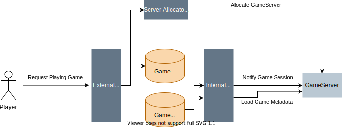
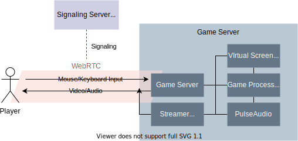

# mashimaro

Open Source Cloud Gaming platform with WebRTC, Wine and Kubernetes.

## Getting Started

### Prerequisites

1. Sign-up [Ayame Labo](https://ayame-labo.shiguredo.jp/)
2. Put signaling key and your GitHub account to `.env` as follows:

```sh
cp .env.example .env
vi .env # Put your secrets
```

### Installation on local minikube cluster

- minikube
- helm
- skaffold
- kustomize
- npm

```sh
make up   # setup kubernetes cluster
make run  # deploy backends
make web  # open client on web browser
...
make down # shutdown cluster
```

### Installation on local docker-compose

- docker-compose
- npm
  
  
```sh
docker-compose up -d
make web             # open client on web browser

docker-compose down
```


## Architecture

### Creating Game Session



### Playing Game




## Contributing

### Local development

The following components are required

- Desktop environment with X11
- GStreamer
- PulseAudio
  - requires `load-module module-native-protocol-tcp`
- Wine (stable latest)
- Go 1.15+
- Gstreamer dev headers
  - libgstreamer1.0-dev
  - libgstreamer-plugins-base1.0-dev

### Testing 

```sh
make test
```

## License

MIT

## Author

[castaneai](https://github.com/castaneai)

## Acknowledgements

- [azyobuzin/whc](https://github.com/azyobuzin/whc)
- [GoogleCloudPlatform/selkies-vdi](https://github.com/GoogleCloudPlatform/selkies-vdi/)
- [nurdism/neko](https://github.com/nurdism/neko)
